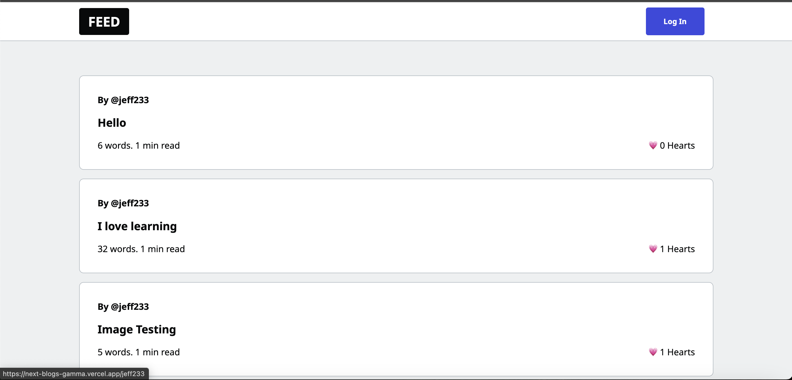
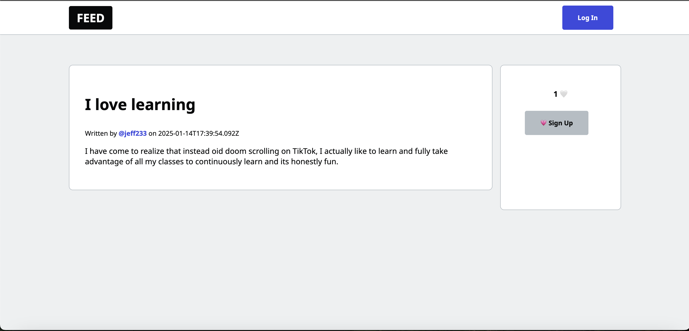
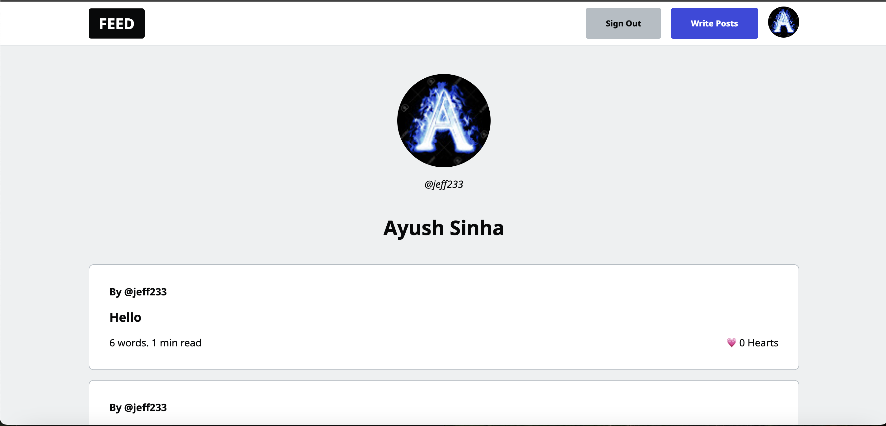

# Next Blogging | https://next-blogs-gamma.vercel.app

## Description
Next Blogging is a full-stack social blogging platform built with Next.js, React, and Firebase for real-time content publishing. It features custom usernames, user authentication via OAuth 2.0, a heart/unheart system, and image uploads. Server-side rendering (SSR) and Incremental Static Regeneration (ISR) ensure fast performance and SEO optimization. Data is managed with Firestore, while Vercel handles deployment with Firebase security rules for protection.

## Pictures

  

  Above is an example home page.

  

  Above is an example post page.

  

  Above is an example profile page.

## Tech Stack
- 
- 
- 
- 
- 
- OAuth 2.0
